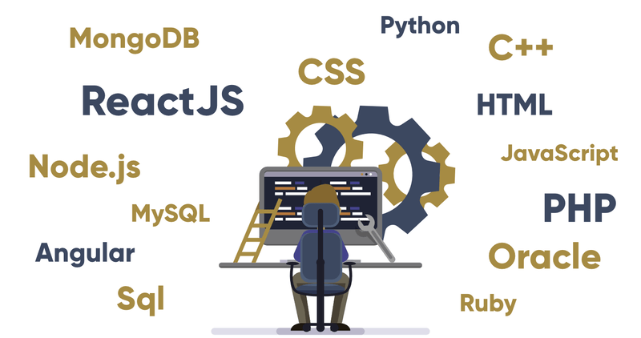




<section class="hero is-medium">
  

        <h1 class="title is-1">
        Hey, I am Akshata.
        </h1>
        

        

            

                

                    I am a Software Engineer with 7+ years of experience building fullstack applications for research organizations, enterprises and startups.
                

                

                    I am a self-taught developer. I graduated from IIT Kharagpur, India with a major in Architecture. I am based in Singapore. Over the past 7 years, I have built computational design tools, revamped K-drama video-on-demand platforms and made sense of ed-tech data.
                       
                    I love to learn and I have multiple online degrees in Mobile Development, Artificial Intelligence and Blockchain Engineering. I was also part of Kernal Block 7.
                       
                    I enjoy building large-scale end-to-end fullstack systems that solve a problem. 
                

                
 
                    I am mostly active on  <a href='https://github.com/akshatamohanty' target='_blank'>Github</a> and <a href='https://twitter.com/iamaatoh' target='_blank'>Twitter</a>.
                

            

            

                <figure class="image is-rounded is-1by1">
                
                </figure>
            

        

        

    

</section>

<section class="hero is-medium is-link">
  

    <h1 class="title is-1">
      Practical Blockchain
    </h1>
    

        

            

                We are moving towards a decentralized world.
                  
                

                     It might or might not be completely decentralized. But knowledge never goes to waste. I have embarked on a mission to learn and educate more engineers towards this paradigm in technology.   
                       
                    If you are excited to learn about decentralized applications, distributed ledgers, cryptographic proofs and web3, join us.
                      
                    

                        <a href='https://www.meetup.com/practical-blockchain/' target='_blank'>
                            <button class="button is-info">Join us at&nbsp;<b>Practical Blockchain</b></button>
                        </a>
                    

                

            

            

               <figure class="image is-16by9">
                <iframe class="has-ratio" width="640" height="360" src="https://www.youtube.com/embed/jvM-SHpqWrQ" frameborder="0" allowfullscreen></iframe>
                </figure>
            

        

    

    

</section>

<section class="section is-medium is-primary">
  <h1 class="title is-1">Topics I talk about</h1>
  
Building and learning, one day at a time.

    
  

    

        <a href='/fullstack-engineering'>
            

                <header class="card-header">
                    

                    Fullstack Engineeering
                    

                </header>
                

                    <figure class="image is-4by3">
                    
                    </figure>
                

            

        </a>
    

    <!-- 

        <a href='/web-and-performance'>
            

                <header class="card-header">
                    

                    Web & Performance
                    

                </header>
                

                    <figure class="image is-4by3">
                    
                    </figure>
                

            

        </a>
    
 -->
    <!-- 

        <a href='/system-design'>
            

                <header class="card-header">
                    

                    System Design
                    

                </header>
                

                    <figure class="image is-4by3">
                        
                    </figure>
                

            

        </a>
    
 -->
    

        <a href='/blockchain-and-web3'>
            

                <header class="card-header">
                    

                     Blockchain & Web3
                    

                </header>
                

                    <figure class="image is-4by3">
                    
                    </figure>
                

            

        </a>
    

    <!-- 

        <a href='/engineering-startups'>
            

                <header class="card-header">
                    

                     Engineering @startups
                    

                </header>
                

                    <figure class="image is-4by3">
                    
                    </figure>
                

            

        </a>
    
 -->
    

        <a href='/algorithms-and-datastructures'>
            

                <header class="card-header">
                    

                    Algorithms & Data Structures
                    

                </header>
                

                    <figure class="image is-4by3">
                    
                    </figure>
                

            

        </a>
    

  

</section>

<section class="section is-small is-link">
    <article class="message is-dark">
        

            <h1 class="title is-1">The Startup Engineer</h1>
            

                Startups are hard. And engineering for startups harder. Building for startups requires coordinating fast iterations without techincal debt.
                I am addressing this issue in my new newsletter - <b>The Startup Engineer</b>. I will be posting weekly articles, interviews and strategies to building for startups. 
                  
                To subscribe to updates, sign up below
                  
                <button class='button is-link'><b>I am a Startup Engineer!</b></button>
            

        

    </article>
</section>

<section class="section is-medium is-primary">
  <h1 class="title is-1">Speaking Events & Workshops</h1>
    

    

        I am a self-taught engineer. Much of what I learned is because others sharing their knowledge freely. I love all endeavours towards building open-access education, learning communities, events etc.
          
        If you'd like to invite me to speak, 
        reach out at <b>iamaatoh@gmail.com</b>
    

    

        <figure>
            
        </figure>
    

   

</section>


